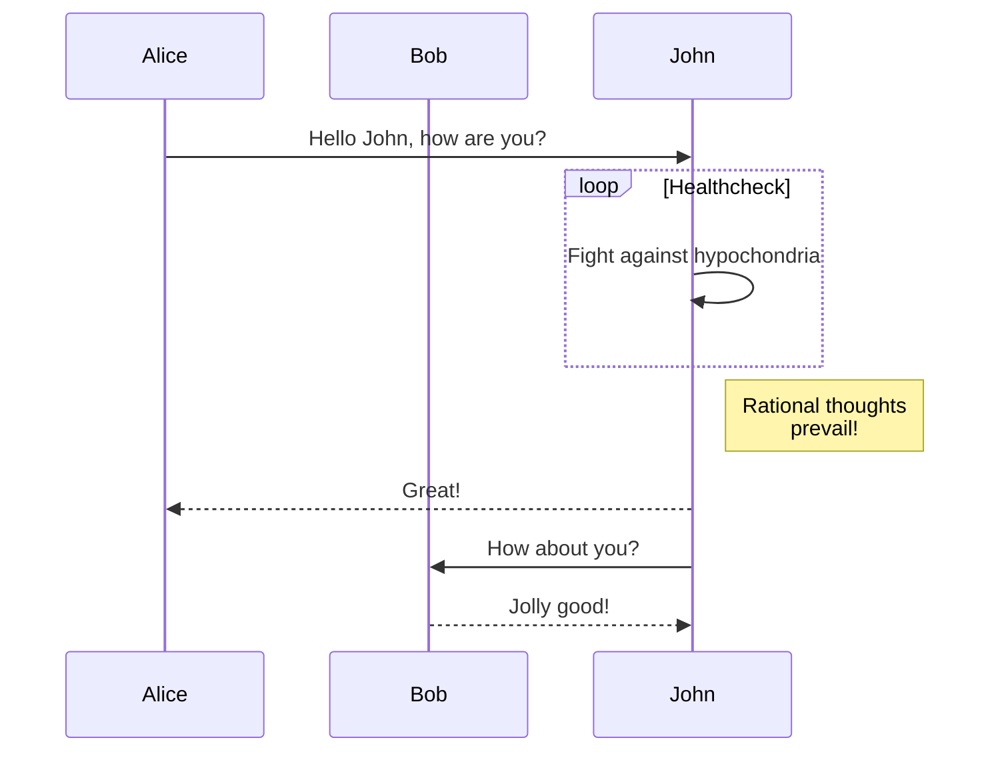

# Simplicity, Efficiency, and the Art of Learning

## Introduction

### Why am I writing this blog post?

My work involves modeling *complex biological systems* and *networks* using mathematics. Mathematical models are valuable tools for understanding biological systems and processes. 

However, biological systems are incredibly complex, so models must balance realism with simplicity. Simpler models are more robust and generalizable despite not capturing every detail.

For example, the SIR model is one of the simplest models of infectious disease spread. It divides the population into three compartments - Susceptible, Infected, and Recovered (hence the name SIR model). Despite its simplicity, the SIR model provides key insights into herd immunity, the impact of vaccination, and epidemic dynamics. 


Let's have a look at the SIR model diagram below to understand the power of simplicity:


1. This SIR model diagram is helpful for people to understand infectious disease spread, regardless of their academic background. This is because it involves a simple diagram that can be easily visualized and followed, rather than jargon-filled equations.
2. Despite its simplicity, a mathematician can still write down equations describing the SIR model. The three-compartment structure lends itself well to mathematical analysis.

### SIR Model Equations

- Susceptible equation:
  $$\frac{dS}{dt} = -\beta S I$$

- Infected equation:
  $$\frac{dI}{dt} = \beta S I - \gamma I$$

- Recovered equation:
  $$\frac{dR}{dt} = \gamma I$$

Where:
- \( S \): Number of susceptible individuals.
- \( I \): Number of infected individuals.
- \( R \): Number of recovered individuals.
- \( \beta \): Transmission rate.
- \( \gamma \): Recovery rate.

3. A computer programmer can then take those equations and plot simulations of disease spread under different conditions. The programmer also has the flexibility to add complexity to the model since the framework is robust.

``` python
### SIR Model Coding

import numpy as np
from scipy.integrate import odeint
import matplotlib.pyplot as plt

#### SIR model differential equations.
def sir_model(y, t, beta, gamma):
    S, I, R = y
    dS_dt = -beta * S * I
    dI_dt = beta * S * I - gamma * I
    dR_dt = gamma * I
    return ([dS_dt, dI_dt, dR_dt])

#### Initial conditions: 990 susceptible, 10 infected, 0 recovered
S0 = 990
I0 = 10
R0 = 0
beta = 0.3  # infection rate: 0.3
gamma = 0.1  # recovery rate: 0.1

#### Time vector
t = np.linspace(0, 160, 160)

#### Integrate the SIR equations over the time grid.
solution = odeint(sir_model, [S0, I0, R0], t, args=(beta, gamma))
solution = np.array(solution)

#### Plot the results
plt.figure(figsize=[6, 4])
plt.plot(t, solution[:, 0], label="S(t) - Susceptible")
plt.plot(t, solution[:, 1], label="I(t) - Infected")
plt.plot(t, solution[:, 2], label="R(t) - Recovered")
plt.grid()
plt.legend()
plt.xlabel("Time (days)")
plt.ylabel("Population")
plt.title("SIR Model of Disease Spread")
plt.show()
```


4. We can then design effective policies to control disease outbreaks based on the model predictions.


This was all made possible because the SIR model focuses on abstracting the complex real world into a simple model. Rather than trying to incorporate every detail initially, it starts simple, and complexity can be added later. This demonstrates why beginning with simplicity is so valuable in biological modeling. It enables clear understanding, mathematical tractability, computational simulation, and practical applications. Starting simple and flexible provides a strong foundation before adding complexity where needed


Here, talk about why you decided to write this post and provide a brief overview of the points you're going to discuss.

## Simplicity is the Backbone of Robustness

In this section, explain why simplicity is key to creating robust systems, using examples from nature, science, or your own field - computational biology.

## Information and Complexity Can Be Distracting and Inefficient

Here, discuss the downsides of overloading with information and complexity. You can talk about cognitive load, decision fatigue, analysis paralysis, etc. and how they affect creativity and efficiency.

## Learning New Things Requires Starting from an Empty Slate

Dive into the concept of "beginner's mind" or "Shoshin". Discuss how preconceived notions or biases can hinder learning. You might want to share your personal experiences of learning new programming languages like Go or complex concepts in population genetics.

## Human Mind Thinks in Logarithmic Fashion, It's Important to Make It Efficient

In this section, explain how the human mind perceives information in logarithmic terms. Discuss how this affects our learning, decision-making, and perception of the world. You could also provide some tips on how to leverage this for efficient learning.

## Conclusion

Wrap up your post by summarizing the key points and offering some practical tips or insights for your readers on embracing simplicity and efficiency in their learning journey.

## References

If you cited any research, book, or article in your blog post, list them here in proper format.



