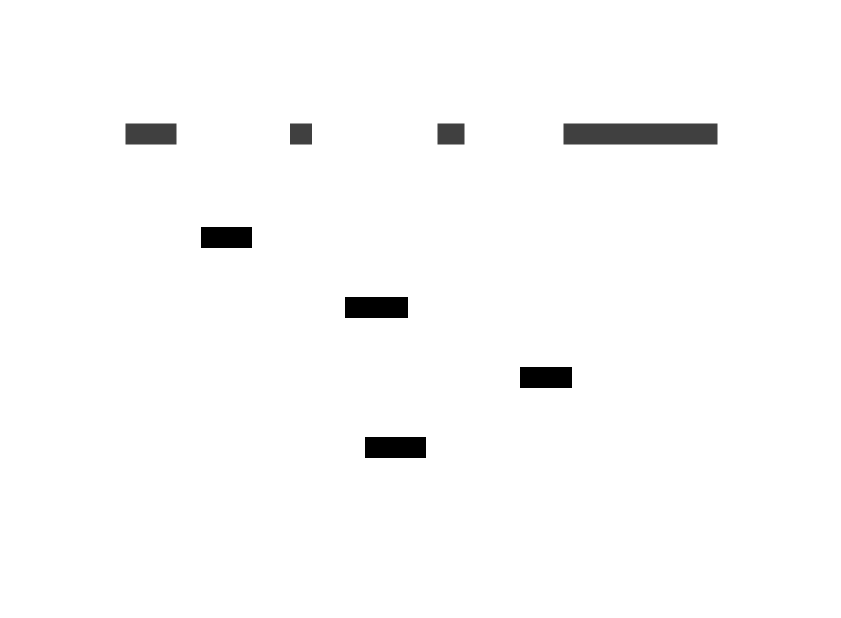

# Simplicity, Efficiency, and the Art of Learning

## Introduction

A simple diagram which shows the simplified model of the lac operon, a well-studied gene regulatory network in E. coli.

Here, talk about why you decided to write this post and provide a brief overview of the points you're going to discuss.

## Simplicity is the Backbone of Robustness

In this section, explain why simplicity is key to creating robust systems, using examples from nature, science, or your own field - computational biology.

## Information and Complexity Can Be Distracting and Inefficient

Here, discuss the downsides of overloading with information and complexity. You can talk about cognitive load, decision fatigue, analysis paralysis, etc. and how they affect creativity and efficiency.

## Learning New Things Requires Starting from an Empty Slate

Dive into the concept of "beginner's mind" or "Shoshin". Discuss how preconceived notions or biases can hinder learning. You might want to share your personal experiences of learning new programming languages like Go or complex concepts in population genetics.

## Human Mind Thinks in Logarithmic Fashion, It's Important to Make It Efficient

In this section, explain how the human mind perceives information in logarithmic terms. Discuss how this affects our learning, decision-making, and perception of the world. You could also provide some tips on how to leverage this for efficient learning.

## Conclusion

Wrap up your post by summarizing the key points and offering some practical tips or insights for your readers on embracing simplicity and efficiency in their learning journey.

## References

If you cited any research, book, or article in your blog post, list them here in proper format.
