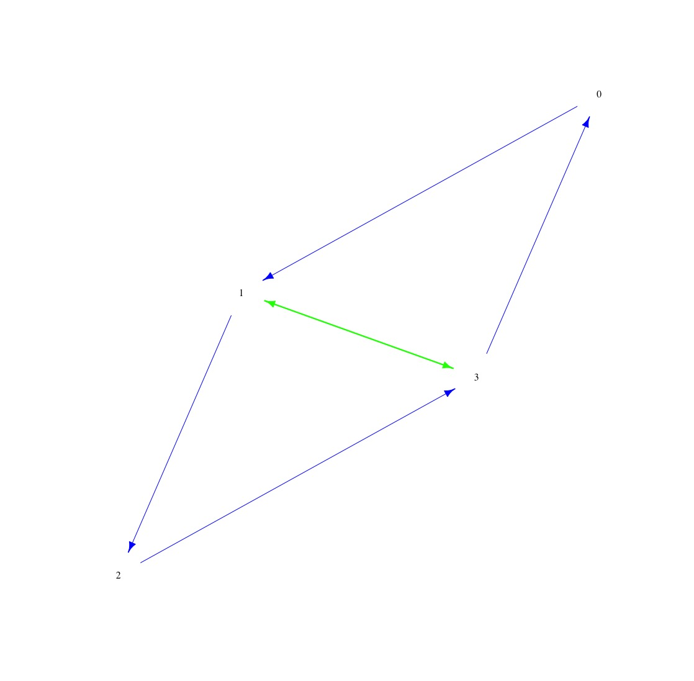

### Introduction

In this tutorial, we will explore the concept of Topological Data Analysis (TDA) and its significance in data analysis. TDA helps uncover hidden structures in complex data by analyzing topological features such as connected components, loops, and voids.

### Prerequisites
Before we begin, make sure you have the following prerequisites:

- C++ Compiler (e.g., g++)
- R programming environment
- GUDHI library for C++

You can install the necessary software and access the data files via the provided links or instructions.

### Part 1: Creating a Filtered Graph in C++
Let's start by creating a filtered graph in C++ using GUDHI.

    #include <gudhi/Flag_complex_edge_collapser.h>
    #include <iostream>
    #include <vector>
    #include <tuple>
    
    int main() {
      // Type definitions
      using Filtration_value = float;
      using Vertex_handle = short;
      using Filtered_edge = std::tuple<Vertex_handle, Vertex_handle, Filtration_value>;
      using Filtered_edge_list = std::vector<Filtered_edge>;
    
      // Define the graph
      Filtered_edge_list graph = {{0, 1, 1.}, {1, 2, 1.}, {2, 3, 1.}, {3, 0, 1.}, {0, 2, 2.}, {1, 3, 2.}};
    
      // Perform edge collapse
      auto remaining_edges = Gudhi::collapse::flag_complex_collapse_edges(graph);
    
      // Display remaining edges
      for (auto filtered_edge_from_collapse : remaining_edges) {
        std::cout << "fn[" << std::get<0>(filtered_edge_from_collapse) << ", " << std::get<1>(filtered_edge_from_collapse)
                  << "] = " << std::get<2>(filtered_edge_from_collapse) << std::endl;
      }
    
      return 0;
    }


#### Expected Output

Now let's see what `./output` gives us:

```./output
fn[1, 3] = 2
fn[0, 1] = 1
fn[1, 2] = 1
fn[2, 3] = 1
fn[3, 0] = 1
```

### Part 2: Plotting the Filtered Graph in R

Now, let's visualize the filtered graph in R using the igraph package.

    # Load the igraph package
    library(igraph)
    
    # Create a custom color palette excluding red
    my_colors <- c("blue", "green", "purple", "orange", "pink")
    
    # Create the graph
    g <- graph_from_data_frame(data.frame(from=c(0, 1, 1, 2, 3, 3), to=c(1, 2, 3, 3, 0, 1), weight=c(1, 1, 2, 1, 1, 2)))
    
    # Plot the graph with colorful edges (excluding red)
    plot(g,
         edge.width=E(g)$weight,
         edge.color=my_colors[E(g)$weight],  # Use the custom color palette
         vertex.color="white",
         vertex.frame.color="white",
         vertex.label.color="black",
         vertex.label.dist=0,
         vertex.size=20,
         main="",
         xlab="",
         ylab="",
         sub="",
         frame=FALSE)



### Conclusion
In this tutorial, you've learned how to create and visualize filtered graphs using C++ (GUDHI), and R (igraph). 

You've also explored the significance of Topological Data Analysis (TDA) in understanding complex data structures.


### Additional Resources
For more information on GUDHI or igraph visualization, you can explore the following resources:

- [GUDHI Documentation](https://gudhi.inria.fr/doc/latest/)
- [igraph Package Documentation](https://igraph.org/r/)


# The Non Dualistic Universe
